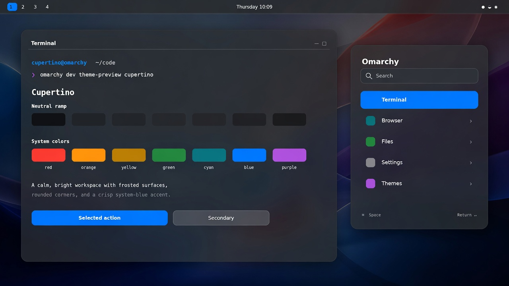

# Cupertino Dark

A dark, macOS-inspired theme for [Omarchy](https://omarchy.org). Light sibling: [Cupertino Light](https://github.com/jonnyace/omarchy-cupertino-light-theme).



System blue accent, frosted shell surfaces, 12px rounding, and Yaru-blue-dark icons.

## Install

```bash
omarchy theme install https://github.com/jonnyace/omarchy-cupertino-dark-theme.git
```

Or copy that URL and choose *Install > Style > Theme* from the Omarchy menu (`Super + Space`).

## Extra wallpapers

The theme ships with one original background. Classic macOS defaults (Tahoe Dark, Sequoia Dark, Sonoma Dark, and earlier) are not bundled — those images are Apple's copyright.

Download them from [Every Default macOS Wallpaper in 6K](https://512pixels.net/projects/default-mac-wallpapers-in-5k/) and drop the files into:

```
~/.config/omarchy/backgrounds/cupertino-dark/
```

Then cycle with `Super + Ctrl + Space` or `omarchy theme bg next`.
